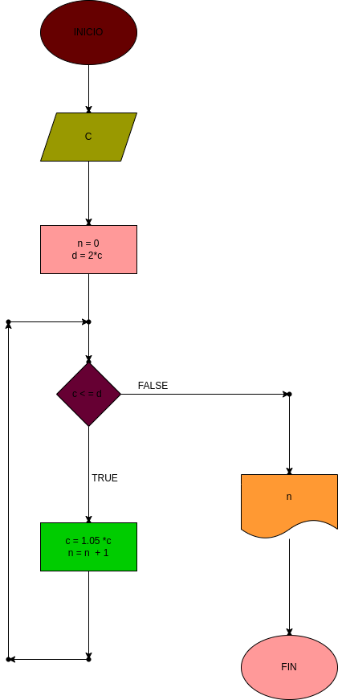

# 
# interes_compuesto
hacer el diagrama de flujo y el programa en python , que lea un capital c , que averigue y imprima en cuantos meses se duplica si lo colocamos a un interes compuesto del 5% mensual

# ANALISIS

--Variables de entrada 

C : el dinero que se ingresa para duplicarlo

-- variables prestablecidas

n : la cantidad de meses que se usaran inican sinedo 0

d : lo que vamos a usar para para el programa cuando C sea el doble

--variables de proceso

C : 1.05*C

n = n +1

--Variables de salida

n : nos da los meses usados en este caso siempre es 15

C : el dinero ganado
--
# DISEÑO

# CONSTRUCCION